# 🤖 AgenticFlow

<div align="center">

**Multi-Agent Workflow System with LangGraph**

[](https://python.org)
[](https://github.com/langchain-ai/langgraph)
[](https://github.com/langchain-ai/langchain)
[](https://fastapi.tiangolo.com)
[](LICENSE)

[Features](#-features) • [Architecture](#-architecture) • [Quick Start](#-quick-start) • [API](#-api-documentation) • [Examples](#-examples)

</div>

---

## 📋 Table of Contents

- [Overview](#-overview)
- [Features](#-features)
- [Architecture](#-architecture)
- [Agents](#-agents)
- [Workflow](#-workflow)
- [Quick Start](#-quick-start)
- [API Documentation](#-api-documentation)
- [Configuration](#-configuration)
- [Examples](#-examples)
- [Testing](#-testing)
- [Deployment](#-deployment)

---

## 🎯 Overview

**AgenticFlow** is a production-ready multi-agent workflow system built with **LangGraph**, **LangChain**, and **FastAPI**. It orchestrates specialized AI agents through complex tasks with automatic routing, checkpointing, and human-in-the-loop capabilities.

### What Makes It Different?

- 🧠 **5 Specialized Agents** - Each agent has a unique role and capabilities
- 🔄 **LangGraph State Machine** - Reliable workflow orchestration with conditional routing
- 🛡️ **Secure Tools** - Sandboxed code execution, file I/O protection
- 📊 **Real-time Progress** - Streaming updates and progress tracking
- 🔌 **REST API** - Easy integration with any application
- 🎨 **Beautiful UI** - Streamlit interface for interactive use

---

## ✨ Features

### Core Capabilities

| Feature | Description |
|---------|-------------|
| 🧩 **Modular Agents** | Planner, Researcher, Analyzer, Writer, Reviewer |
| 🔍 **Web Search** | Tavily + DuckDuckGo fallback for research |
| 📁 **File Operations** | Secure read/write with workspace isolation |
| ⚡ **Code Execution** | Sandboxed Python with timeout |
| 🔢 **Calculator** | Safe mathematical expression evaluation |
| 💾 **Checkpointing** | Memory or SQLite for persistence |
| 🔄 **Revisions** | Automatic refinement loops |
| 👤 **Human-in-the-Loop** | Manual review and feedback |

### Developer Experience

- ✅ Type hints throughout
- ✅ Comprehensive docstrings
- ✅ 60+ test cases
- ✅ Docker support
- ✅ Auto-generated API docs
- ✅ Production-ready logging

---

## 🏗️ Architecture

```
┌─────────────────────────────────────────────────────────────────────┐
│                         AgenticFlow System                          │
├─────────────────────────────────────────────────────────────────────┤
│                                                                       │
│  ┌─────────────┐    ┌──────────────┐    ┌──────────────┐           │
│  │ Streamlit   │    │  FastAPI     │    │  LangGraph   │           │
│  │     UI      │◄──►│     API      │◄──►│  Workflow    │           │
│  │  (Port 8501)│    │  (Port 8000) │    │   Engine     │           │
│  └─────────────┘    └──────────────┘    └──────┬───────┘           │
│                            │                     │                  │
│                            │                ┌────┴─────┐            │
│                            │                │          │            │
│                       ┌────▼────┐      ┌────▼──┐   ┌───▼────┐      │
│                       │ Storage │      │  LLM  │   │ Tools  │      │
│                       │(Memory) │      │(GPT-4)│   │  (8×)  │      │
│                       └─────────┘      └───────┘   └────────┘      │
└─────────────────────────────────────────────────────────────────────┘
```

### Technology Stack

- **Orchestration**: LangGraph 0.2+, LangChain 0.3+
- **LLM**: OpenAI GPT-4/Claude (configurable)
- **API**: FastAPI 0.109+ with Uvicorn
- **UI**: Streamlit for demo interface
- **Tools**: Tavily Search, DuckDuckGo, custom tools
- **Storage**: Memory/SQLite checkpointing, optional Redis

---

## 🤖 Agents

### 1. 📋 Planner Agent
**Role**: Break down complex tasks into actionable steps

**System Prompt**:
```
You are an expert Planning Agent. Analyze task requirements
and create step-by-step execution plans.
```

**Tools**: Calculator, Time utilities

**Output**: List of numbered steps

**Example**:
```python
# Input
"Research the latest AI trends"

# Output
[
    "Search for recent AI breakthrough publications",
    "Analyze key trends and patterns",
    "Identify influential researchers",
    "Compile findings into report"
]
```

---

### 2. 🔍 Researcher Agent
**Role**: Gather information from web and documents

**System Prompt**:
```
You are an expert Research Agent. Find reliable sources,
synthesize information, and cite references.
```

**Tools**: Web Search, Read File, List Files, Time

**Output**: Research results with sources

**Example**:
```python
# Research findings
[
    {
        "query": "quantum computing 2024",
        "title": "Quantum Breakthrough",
        "url": "https://example.com",
        "content": "Recent advances...",
        "relevance_score": 0.95
    }
]
```

---

### 3. 📊 Analyzer Agent
**Role**: Analyze data and extract insights

**System Prompt**:
```
You are an expert Analysis Agent. Identify patterns,
draw conclusions, and use computational tools.
```

**Tools**: Calculator, Run Python Code, Read File, List Files

**Output**: Analysis + key findings

**Example**:
```python
{
    "analysis": "Comprehensive analysis of research data...",
    "key_findings": [
        "Quantum volume increased 100x in 2024",
        "New error correction techniques emerged",
        "Major tech investments accelerating"
    ]
}
```

---

### 4. ✍️ Writer Agent
**Role**: Create written content

**System Prompt**:
```
You are an expert Writer Agent. Create clear,
professional content based on research and analysis.
```

**Tools**: Read File, Write File, Time utilities

**Output**: Draft content

**Example**:
```python
{
    "draft": "# Quantum Computing in 2024\n\nRecent developments...",
    "revision_count": 2
}
```

---

### 5. 👁️ Reviewer Agent
**Role**: Evaluate and provide feedback

**System Prompt**:
```
You are an expert Review Agent. Evaluate content quality
and provide constructive feedback.
```

**Tools**: Read File, Calculator

**Output**: Approval status + feedback

**Example**:
```python
{
    "approval_status": "needs_revision",
    "feedback": [
        "Add more recent sources",
        "Expand technical details",
        "Include expert quotes"
    ]
}
```

---

## 🔄 Workflow

### Workflow Diagram

```mermaid
graph TD
    START([Start]) --> PLANNER[📋 Planner]
    PLANNER -->|Create plan| RESEARCHER[🔍 Researcher]
    RESEARCHER -->|Gather info| ANALYZER[📊 Analyzer]
    ANALYZER -->|Extract insights| WRITER[✍️ Writer]
    WRITER -->|Create draft| REVIEWER[👁️ Reviewer]

    REVIEWER -->|Approved| END([Complete])
    REVIEWER -->|Needs revision| WRITER
    REVIEWER -->|Rejected| END

    style START fill:#e1f5e1
    style END fill:#ffe1e1
    style PLANNER fill:#e3f2fd
    style RESEARCHER fill:#fff3e0
    style ANALYZER fill:#f3e5f5
    style WRITER fill:#e0f2f1
    style REVIEWER fill:#fce4ec
```



### State Flow

```
1. PLANNING     → Planner creates execution plan
2. RESEARCHING  → Researcher gathers information
3. ANALYZING    → Analyzer extracts insights
4. WRITING      → Writer creates content
5. REVIEWING    → Reviewer evaluates
6. COMPLETE     → Ready for delivery

Loops:
- Reviewer → Writer (if revision needed)
- Max revisions: 10 (configurable)
```

---

## 🚀 Quick Start

### Prerequisites

- Python 3.11+
- OpenAI API key
- (Optional) Tavily API key for web search
- (Optional) Anthropic API key for Claude models

### Installation

```bash
# Clone repository
git clone https://github.com/yourusername/agenticflow.git
cd agenticflow

# Install dependencies
pip install -r requirements.txt

# Configure environment
cp .env.example .env
# Edit .env with your API keys

# Run API
python src/api/main.py
```

### Docker Quick Start

```bash
# Build and start all services
docker-compose up -d

# View logs
docker-compose logs -f

# Stop services
docker-compose down
```

### Verify Installation

```bash
# Health check
curl http://localhost:8000/api/v1/health

# Expected response
{
  "status": "healthy",
  "version": "0.1.0",
  "active_workflows": 0
}
```

---

## 📡 API Documentation

### Base URL
```
http://localhost:8000/api/v1
```

### Interactive Docs
```
http://localhost:8000/docs
```

### Core Endpoints

#### 1. Start Workflow
```http
POST /workflow/start
Content-Type: application/json

{
  "task": "Research quantum computing trends",
  "task_type": "research",
  "model_name": "gpt-4o-mini",
  "max_iterations": 5
}
```

**Response**:
```json
{
  "workflow_id": "abc-123-def",
  "status": "pending",
  "message": "Workflow started",
  "created_at": "2024-01-15T10:30:00"
}
```

---

#### 2. Get Status
```http
GET /workflow/{workflow_id}/status
```

**Response**:
```json
{
  "workflow_id": "abc-123",
  "status": "researching",
  "progress": {
    "progress_percent": 35,
    "steps_completed": 1,
    "total_steps": 4,
    "elapsed_time_seconds": 45.2
  }
}
```

---

#### 3. Stream Updates
```http
GET /workflow/{workflow_id}/stream
```

**Server-Sent Events**:
```
data: {"event": "node_exit", "node": "planner", "timestamp": "..."}

data: {"event": "node_exit", "node": "researcher", "timestamp": "..."}

data: {"type": "complete", "workflow_id": "abc-123"}
```

---

#### 4. Get Result
```http
GET /workflow/{workflow_id}/result
```

**Response**:
```json
{
  "workflow_id": "abc-123",
  "status": "complete",
  "final_output": "# Quantum Computing Report\n...",
  "approval_status": "approved",
  "duration_seconds": 120.5
}
```

---

#### 5. Submit Feedback
```http
POST /workflow/{workflow_id}/feedback
Content-Type: application/json

{
  "feedback": "Add more sources",
  "action": "revise"
}
```

---

## ⚙️ Configuration

### Environment Variables

| Variable | Description | Default |
|----------|-------------|---------|
| `OPENAI_API_KEY` | OpenAI API key | Required |
| `ANTHROPIC_API_KEY` | Anthropic API key | Optional |
| `TAVILY_API_KEY` | Tavily search key | Required |
| `DEFAULT_MODEL` | Default LLM | `gpt-4o-mini` |
| `MAX_ITERATIONS` | Max revisions | `10` |
| `TIMEOUT_SECONDS` | Agent timeout | `300` |
| `CHECKPOINT_STORAGE` | memory/sqlite | `memory` |
| `LOG_LEVEL` | Logging level | `INFO` |

---

## 💡 Examples

### Example 1: Python SDK

```python
import httpx

# Start workflow
response = httpx.post("http://localhost:8000/api/v1/workflow/start", json={
    "task": "What are the latest developments in quantum computing?",
    "task_type": "research"
})
workflow_id = response.json()["workflow_id"]

# Poll for completion
while True:
    status = httpx.get(f"http://localhost:8000/api/v1/workflow/{workflow_id}/status")
    if status.json()["status"] in ["complete", "error"]:
        break
    time.sleep(5)

# Get result
result = httpx.get(f"http://localhost:8000/api/v1/workflow/{workflow_id}/result")
print(result.json()["final_output"])
```

---

### Example 2: cURL

```bash
# Start workflow
curl -X POST http://localhost:8000/api/v1/workflow/start \
  -H "Content-Type: application/json" \
  -d '{
    "task": "Write a blog post about AI in healthcare",
    "task_type": "content_creation"
  }'
```

---

### Example 3: Direct Workflow

```python
from src.workflows import create_workflow

# Create workflow
workflow = create_workflow(model_name="gpt-4o")

# Run synchronously
state = workflow.run(
    task="Analyze the pros and cons of remote work",
    task_type="analysis"
)

print(state["final_output"])
print(state["key_findings"])
```

---

## 🧪 Testing

```bash
# Run all tests
python run_tests.py

# With coverage
python run_tests.py --coverage

# Specific category
pytest tests/test_agenticflow.py::TestTools -v
```

---

## 🚢 Deployment

### Docker
```bash
docker build -t agenticflow:latest .
docker run -p 8000:8000 -e OPENAI_API_KEY=$KEY agenticflow:latest
```

### Docker Compose
```bash
docker-compose up -d
```

### Kubernetes
```bash
kubectl apply -f k8s/
```

---

## 📄 License

MIT License - see [LICENSE](LICENSE) for details.

---

<div align="center">

**Built with ❤️ for the AI Engineer community**

[⭐ Star](https://github.com/yourusername/agenticflow) •
[🍴 Fork](https://github.com/yourusername/agenticflow/fork) •
[🐛 Issues](https://github.com/yourusername/agenticflow/issues)

</div>
