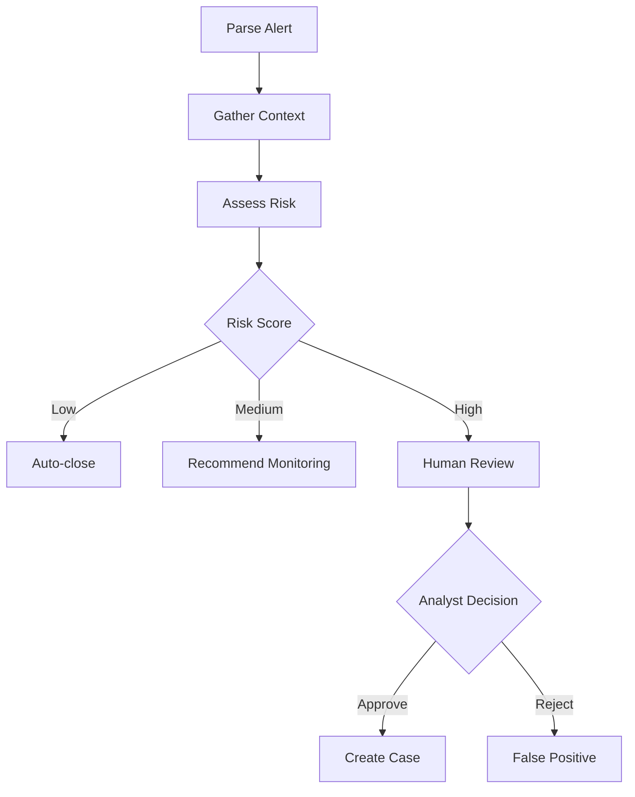

# FraudTriage-Agent

A LangGraph-based multi-step AI agent for fraud alert triage, inspired by real-world banking fraud analyst workflows.

## Overview

This project implements an intelligent fraud alert triage system that:

1. **Parses** incoming fraud alerts from various sources
2. **Gathers context** from transaction history, customer profiles, and device fingerprints
3. **Assesses risk** using LLM-powered analysis with GLM-4.7
4. **Routes** alerts based on risk scores (auto-close, escalate, or human review)
5. **Recommends actions** for fraud analysts

## Tech Stack

- **LangGraph**: Multi-step agent workflow orchestration
- **LangChain**: LLM integration and tool management
- **GLM-4.7**: Primary LLM backend (via Zhipu AI)
- **FastAPI**: REST API for alert submission and management
- **Pydantic**: Data validation and type safety

## Project Structure

```
FraudTriage-Agent/
├── src/
│   ├── agents/          # LangGraph agent definitions
│   ├── tools/           # Context gathering tools
│   ├── api/             # FastAPI endpoints
│   ├── models/          # Pydantic data models
│   ├── utils/           # Helper functions
│   └── config/          # Configuration management
├── tests/
│   ├── unit/            # Unit tests
│   └── integration/     # Integration tests
├── data/
│   ├── sample_alerts/   # Example fraud alerts
│   └── mock_data/       # Mock external API responses
├── requirements.txt
├── pyproject.toml
└── .env.example
```

## Installation

```bash
# Clone the repository
git clone <your-repo-url>
cd FraudTriage-Agent

# Create virtual environment
python3.11 -m venv .venv
source .venv/bin/activate  # On Windows: .venv\Scripts\activate

# Install dependencies
pip install -r requirements.txt

# Copy environment template
cp .env.example .env

# Edit .env with your API keys
nano .env
```

## Configuration

Edit `.env` file with your credentials:

```bash
# GLM-4.7 API (Primary LLM)
GLM_API_KEY=your_glm_api_key_here

# Optional: OpenAI (Fallback)
OPENAI_API_KEY=your_openai_api_key_here

# LangSmith (Optional - for tracing)
LANGCHAIN_TRACING_V2=true
LANGCHAIN_API_KEY=your_langsmith_api_key_here
```

## Usage

### Start the API Server

```bash
python -m src.api.main
```

The API will be available at `http://localhost:8000`

### Submit a Fraud Alert

```bash
curl -X POST http://localhost:8000/api/v1/alerts \
  -H "Content-Type: application/json" \
  -d @data/sample_alerts/sample_alert.json
```

### Run Tests

```bash
# Run all tests
pytest

# Run with coverage
pytest --cov=src --cov-report=html

# Run specific test categories
pytest -m unit          # Unit tests only
pytest -m integration   # Integration tests only
pytest -m "not llm"     # Skip tests that call LLMs
```

## Agent Workflow

The LangGraph agent follows this workflow:



### State Schema (TypedDict)

```python
class AgentState(TypedDict):
    alert_id: str
    alert_data: dict
    transaction_history: list
    customer_profile: dict
    device_fingerprint: dict
    risk_score: int
    risk_factors: list[str]
    recommendation: str
    human_review_required: bool
    human_decision: Optional[str]
    next_action: str
    messages: list[BaseMessage]
```

## API Endpoints

- `POST /api/v1/alerts` - Submit a new fraud alert
- `GET /api/v1/alerts/{alert_id}` - Get alert details
- `GET /api/v1/alerts/{alert_id}/status` - Get triage status
- `POST /api/v1/alerts/{alert_id}/review` - Submit human review decision
- `GET /api/v1/alerts` - List all alerts (with filtering)

## Development

```bash
# Format code
black src/ tests/

# Lint code
ruff check src/ tests/

# Type checking
mypy src/

# Run pre-commit hooks
pre-commit run --all-files
```

## Portfolio Context

This project demonstrates:

- **LangGraph expertise**: Multi-step agent workflows with conditional routing
- **Financial services domain knowledge**: Realistic fraud triage workflow
- **Type safety**: TypedDict state and Pydantic models throughout
- **Production readiness**: FastAPI, testing, observability with LangSmith
- **LLM flexibility**: Support for multiple LLM backends (GLM-4.7, GPT-4, etc.)

## License

MIT
