# FraudTriage-Agent Workflow Documentation

This document provides a comprehensive explanation of the FraudTriage-Agent workflow, including the Mermaid diagram, node descriptions, and routing logic.

## Workflow Diagram

```mermaid
graph TD
    %% =============================================================
    %% FraudTriage-Agent Workflow Diagram
    %% =============================================================

    %% Nodes
    START([Start: Alert Received])
    PARSE[parse_alert]
    CONTEXT[gather_context]
    ANALYZE[analyze_risk]

    %% Decision nodes
    ESCALATE[escalate_alert]
    RECOMMEND[recommend_action]
    CLOSE[auto_close_alert]

    %% End points
    END_ESCALATE([End: Escalated to Fraud Team])
    END_RECOMMEND([End: Action Recommended])
    END_CLOSE([End: Auto-Closed as False Positive])

    %% =============================================================
    %% Main Flow
    %% =============================================================
    START --> PARSE

    PARSE -->|Validate Data| CONTEXT

    CONTEXT -->|Call Tools| ANALYZE

    %% =============================================================
    %% Conditional Routing
    %% =============================================================
    ANALYZE -->|risk_score > 0.8| ESCALATE
    ANALYZE -->|0.4 < risk_score ≤ 0.8| RECOMMEND
    ANALYZE -->|risk_score ≤ 0.4| CLOSE

    %% =============================================================
    %% End Points
    %% =============================================================
    ESCALATE --> END_ESCALATE
    RECOMMEND --> END_RECOMMEND
    CLOSE --> END_CLOSE

    %% =============================================================
    %% Styling
    %% =============================================================
    style START fill:#e1f5e1,stroke:#4caf50,stroke-width:3px
    style PARSE fill:#e3f2fd,stroke:#2196f3,stroke-width:2px
    style CONTEXT fill:#e3f2fd,stroke:#2196f3,stroke-width:2px
    style ANALYZE fill:#fff3e0,stroke:#ff9800,stroke-width:2px

    style ESCALATE fill:#ffebee,stroke:#f44336,stroke-width:3px
    style RECOMMEND fill:#fff8e1,stroke:#ffc107,stroke-width:2px
    style CLOSE fill:#e8f5e9,stroke:#4caf50,stroke-width:2px

    style END_ESCALATE fill:#ffebee,stroke:#f44336,stroke-width:3px
    style END_RECOMMEND fill:#fff8e1,stroke:#ffc107,stroke-width:2px
    style END_CLOSE fill:#e8f5e9,stroke:#4caf50,stroke-width:2px
```



---

## Node Descriptions

### 1. parse_alert

**Purpose**: Validate and extract information from the incoming fraud alert.

**Input**: Initial state with raw alert data
- `alert_id`: Unique alert identifier
- `alert_type`: Type of fraud alert (enum)
- `transaction_amount`: Transaction amount
- `customer_id`: Customer identifier
- Additional optional fields

**Processing**:
1. Validates required fields (customer_id, transaction_amount > 0)
2. Initializes `processing_started` timestamp
3. Adds system message to workflow
4. Increments `iteration_count`

**Output**: Validated state with extracted information

**Error Handling**:
- If validation fails, sets `error_message` and stops workflow

---

### 2. gather_context

**Purpose**: Call fraud detection tools to gather comprehensive context about the alert.

**Tool Calls** (executed sequentially but could be parallelized):

| Tool | Purpose | Output |
|------|---------|--------|
| `get_customer_profile` | Customer account details, verification status, risk rating | Customer profile dict |
| `get_transaction_history` | Historical transactions for pattern analysis | List of transactions |
| `check_watchlists` | Screen against OFAC, internal fraud DB | List of watchlist hits |
| `calculate_risk_score` | Rule-based risk calculation | Risk score (0-1), factors |
| `get_similar_alerts` | Historical alerts with same type | List of similar alerts |

**State Updates**:
- `customer_profile`: dict
- `transaction_history`: list
- `watchlist_hits`: list
- `similar_alerts`: list
- `risk_score`: float (0-1)
- `confidence`: float (0-1)
- `tools_used`: list[str]
- `transaction_patterns`: dict
- `customer_risk_history`: dict
- `ip_reputation`: dict

**Error Handling**:
- If a tool fails, logs error and continues with conservative defaults
- Sets `error_message` if critical tools fail

---

### 3. analyze_risk

**Purpose**: Use LLM to synthesize all gathered context and produce final risk assessment and decision.

**LLM Input**:
- Alert details (type, amount, customer)
- Customer profile summary (account age, verification, risk rating)
- Transaction history summary (count, average, patterns)
- Calculated risk score and factors
- Watchlist hits
- Similar alerts with outcomes
- Transaction country and device
- Account age and verification status

**LLM Task**:
1. Analyze all provided context
2. Calculate or validate risk score (0.0-1.0)
3. Determine risk level (LOW/MEDIUM/HIGH/CRITICAL)
4. Identify specific risk factors
5. Make decision (auto_close/review_required/escalate)
6. Provide detailed reasoning

**State Updates**:
- `risk_level`: RiskLevel enum
- `risk_factors`: list[str]
- `decision`: AlertDecision enum
- `recommendation`: str
- `requires_human_review`: bool
- `messages`: Adds AI message

**Fallback**:
- If LLM fails, uses rule-based decision from `risk_score`
- Conservative defaults if critical error

---

### 4. escalate_alert

**Purpose**: Handle high-risk alerts that require immediate escalation to fraud team.

**Trigger**: `risk_score > 0.8`

**Actions**:
1. Sets `decision = ESCALATE`
2. Sets `requires_human_review = True`
3. Calculates `processing_duration_ms`
4. Sets `processing_completed` timestamp
5. Builds escalation recommendation message

**Recommendation Example**:
```
Alert ALERT-001 escalated due to high risk score (0.875).
Risk factors: Very new account, Transaction amount 100x higher,
Customer KYC not verified, High-risk alert type.
Immediate review required.
```

**Use Cases**:
- Confirmed or strongly suspected fraud
- Account takeover attempts
- Transactions from high-risk countries
- New device + unusual location + high amount

---

### 5. recommend_action

**Purpose**: Handle medium-risk alerts that need monitoring or additional review.

**Trigger**: `0.4 < risk_score ≤ 0.8`

**Actions**:
1. Sets `decision = REVIEW_REQUIRED`
2. Sets `requires_human_review = True`
3. Calculates `processing_duration_ms`
4. Sets `processing_completed` timestamp
5. Builds action recommendation message

**Recommendation Example**:
```
Alert ALERT-002 requires review (risk score: 0.625).
Recommend: Monitor for additional indicators.
Factors: Relatively new account, Transaction amount 5x higher.
```

**Use Cases**:
- Suspicious but not clearly fraudulent
- Moderate deviations from normal patterns
- Alerts requiring additional verification
- Gray area needing human judgment

---

### 6. auto_close_alert

**Purpose**: Handle low-risk alerts that are clearly false positives.

**Trigger**: `risk_score ≤ 0.4`

**Actions**:
1. Sets `decision = AUTO_CLOSE`
2. Sets `requires_human_review = False`
3. Calculates `processing_duration_ms`
4. Sets `processing_completed` timestamp
5. Builds closure reason message

**Recommendation Example**:
```
Alert ALERT-003 auto-closed as false positive (0.185).
No significant fraud indicators detected. Transaction appears legitimate.
```

**Use Cases**:
- Established customers with normal patterns
- Small deviations from average
- Known devices and locations
- No watchlist hits

---

## Routing Logic

### Decision Function: `route_decision(state)`

The routing function determines which decision node to execute based on the risk score.

```python
def route_decision(state: FraudTriageState) -> Literal["escalate", "recommend", "auto_close"]:
    risk_score = state.get("risk_score", 0.0)

    if risk_score > ESCALATE_THRESHOLD:  # 0.8
        return "escalate"
    elif risk_score > RECOMMEND_THRESHOLD:  # 0.4
        return "recommend"
    else:
        return "auto_close"
```

### Decision Matrix

| Risk Score | Risk Level | Decision | Human Review | Action |
|------------|------------|----------|--------------|---------|
| 0.76 - 1.00 | CRITICAL | ESCALATE | YES | Block transaction, escalate to fraud team |
| 0.51 - 0.75 | HIGH | ESCALATE | YES | Escalate to fraud team |
| 0.26 - 0.50 | MEDIUM | REVIEW_REQUIRED | YES | Monitor, additional checks, may require review |
| 0.00 - 0.25 | LOW | AUTO_CLOSE | NO | Close as false positive, archive |

### Thresholds (Configurable)

```python
ESCALATE_THRESHOLD = 0.8  # High risk cutoff
RECOMMEND_THRESHOLD = 0.4  # Medium risk cutoff
```

These can be adjusted in `src/agents/fraud_triage_agent.py` via `AgentConfig`.

---

## State Flow

### Initial State
```python
{
    "alert_id": "ALERT-001",
    "alert_type": AlertType.ACCOUNT_TAKEOVER,
    "transaction_amount": 7500.00,
    "customer_id": "CUST-004",
    "messages": [],
    "iteration_count": 0,
    "processing_started": None,
    # ... other fields initialized to None/empty
}
```

### After parse_alert
```python
{
    "alert_id": "ALERT-001",
    "processing_started": datetime(2025, 1, 30, 14, 25, 0),
    "messages": [SystemMessage("Alert ALERT-001 received...")],
    "iteration_count": 1,
    # ... alert data validated
}
```

### After gather_context
```python
{
    "customer_profile": {...},
    "transaction_history": [...],
    "watchlist_hits": [...],
    "risk_score": 0.625,
    "confidence": 0.8,
    "tools_used": ["get_customer_profile", ...],
    "iteration_count": 2,
    # ... context populated
}
```

### After analyze_risk
```python
{
    "risk_level": RiskLevel.HIGH,
    "risk_factors": ["New account", "High amount", ...],
    "decision": AlertDecision.ESCALATE,
    "recommendation": "Alert escalated...",
    "requires_human_review": True,
    "iteration_count": 3,
    # ... LLM analysis complete
}
```

### After escalate_alert (Final)
```python
{
    "decision": AlertDecision.ESCALATE,
    "recommendation": "Alert escalated due to high risk...",
    "processing_completed": datetime(2025, 1, 30, 14, 25, 2),
    "processing_duration_ms": 2340,
    "iteration_count": 4,
    # ... workflow complete
}
```

---

## Tool Integration

The workflow integrates 5 fraud detection tools:

### 1. get_customer_profile
Retrieves customer account information, KYC status, and risk rating.

### 2. get_transaction_history
Fetches recent transactions for pattern analysis and anomaly detection.

### 3. check_watchlists
Screens against OFAC sanctions list and internal fraud database.

### 4. calculate_risk_score
Performs rule-based risk calculation with weighted factors.

### 5. get_similar_alerts
Finds historical alerts with similar patterns for comparison.

---

## LLM Integration

### Supported LLMs

| Environment | LLM | Use Case |
|-------------|-----|----------|
| Development | Ollama (llama3.2) | Local testing, no API key needed |
| Demo | GLM-4.7 | Presentations, Chinese market |
| Production | OpenAI GPT-4o | Production workloads |

### LLM Factory

```python
llm = create_llm(environment="demo")
```

### Prompt Strategy

The LLM receives:
1. **System prompt**: Expert fraud analyst persona with assessment framework
2. **Context**: All gathered information formatted for readability
3. **Task instructions**: Clear request for structured analysis

The prompt ensures consistent, explainable decisions.

---

## Human-in-the-Loop

### When Human Review is Required

Human review is required for:
- Risk score > 0.4 (MEDIUM or higher)
- All escalated alerts
- Alerts with ambiguous patterns
- Alerts requiring verification

### Human Review Process

1. Alert is marked with `requires_human_review = True`
2. Alert stored in API with decision status
3. Analyst reviews via API endpoint: `POST /triage/{alert_id}/approve`
4. Analyst provides:
   - Decision: approve (legitimate) / reject (fraud) / escalate
   - Reasoning for decision
   - Optional tags for categorization
5. Alert state is updated with human review

### Review Outcomes

| Human Decision | Alert Decision | Action |
|----------------|----------------|--------|
| approve | AUTO_CLOSE | Close as legitimate |
| reject | ESCALATE | Escalate as confirmed fraud |
| escalate | REVIEW_REQUIRED | Request additional review |

---

## Error Handling

### Error Recovery

| Error Type | Handling |
|------------|----------|
| Invalid input data | Stop workflow, set error_message |
| Tool failure | Log error, use conservative defaults |
| LLM failure | Fallback to rule-based decision |
| State corruption | Log error, return partial state |

### Error States

- `status = "error"`
- `error_message` contains details
- `processing_completed` timestamp set
- Decision set conservatively (ESCALATE if uncertain)

---

## Performance Considerations

### Typical Processing Times

| Node | Duration (approx) |
|------|-------------------|
| parse_alert | 5-10ms |
| gather_context | 100-500ms (5 tool calls) |
| analyze_risk | 500-2000ms (LLM invocation) |
| Decision nodes | 5-10ms |
| **Total** | **600-2500ms** |

### Optimization Opportunities

1. **Parallel tool execution**: Run tools concurrently instead of sequentially
2. **Caching**: Cache customer profiles and transaction history
3. **Batch processing**: Process multiple alerts together
4. **Streaming**: Stream LLM responses for faster perceived performance

---

## Monitoring & Observability

### Key Metrics to Track

- Processing time per alert (p50, p95, p99)
- Tool execution times
- LLM latency
- Error rate
- Decision distribution (auto_close vs escalate)
- Human review rate
- False positive rate (from human feedback)

### Logging

Each log entry includes:
- Alert ID for correlation
- Current node being executed
- State changes
- Errors and exceptions

Example:
```
2025-01-30 14:25:00 - INFO - [ALERT-001] 🔍 Parsing alert
2025-01-30 14:25:00 - INFO - [ALERT-001] ✅ Alert parsed successfully
2025-01-30 14:25:00 - INFO - [ALERT-001] 📚 Gathering context
2025-01-30 14:25:00 - INFO - [ALERT-001] ✅ Context gathered - Risk Score: 0.875
2025-01-30 14:25:02 - INFO - [ALERT-001] 🤖 Analyzing risk with LLM
2025-01-30 14:25:02 - INFO - [ALERT-001] ✅ LLM analysis complete - Decision: ESCALATE
2025-01-30 14:25:02 - WARNING - [ALERT-001] 🚨 Alert escalated to fraud team
```

---

## Next Steps

1. **Visualize the workflow**:
   ```bash
   python -m src.utils.visualize
   ```

2. **Export workflow as PNG**:
   ```python
   from src.utils.visualize import export_to_png
   export_to_png("workflow.png")
   ```

3. **Visualize state during execution**:
   ```python
   from src.utils.visualize import visualize_state
   result = await agent.arun(...)
   print(visualize_state(result))
   ```

4. **Integrate with API**:
   - Add visualization endpoint to FastAPI
   - Return Mermaid diagram in API docs
   - Provide state visualization in response
